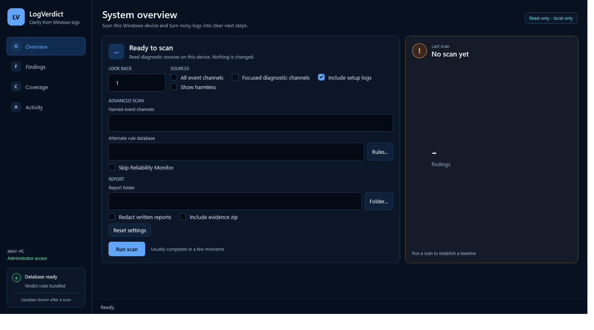

# LogVerdict

   

Scan a Windows PC's logs, collapse them into the handful of distinct things that actually happened, and rule on each one in plain English: **what it means, why it matters, and what to do about it.**

Event Viewer shows you a wall of red icons. LogVerdict collapses repeats, explains what remains in plain English, and puts the highest-priority evidence first. Volatile scan totals are intentionally omitted here; the packaged GUI smoke test generates the current visual reference from the release artifact.



There are two front ends over one engine: a window for reading, and a console tool for scripting. Neither can disagree with the other, because both call the same scan.

## Why

Microsoft [SetupDiag](https://learn.microsoft.com/en-us/windows/deployment/upgrade/setupdiag) already explains
Windows upgrade failures from Panther logs, and [cmtraceopen](https://github.com/adamgell/cmtraceopen) reads
servicing and setup text logs with a findings-oriented interface. LogVerdict's narrower claim is deliberately
testable: it is an offline, local triage pass that rules both Windows event channels and servicing/diagnostic text
logs, deduplicates them into signatures, and returns a plain-English explanation plus a concrete remediation from a
curated non-LLM rule database. SetupDiag remains useful for upgrade-specific cases; cmtraceopen remains useful as a
viewer and text-log specialist.

The rule database prioritizes ordinary Windows breakage and keeps Sysmon and Defender telemetry as contextual
evidence rather than expanding security-product taxonomy without diagnostic value. Use `-DiagnosticChannels` for the
focused operational channels that add signal without requiring a full channel sweep.

## What it reads

| Source | Why it matters |
|---|---|
| System / Application event channels | The bulk of client troubleshooting signal |
| Focused operational channels (`-DiagnosticChannels`) | Storage, code integrity, device setup, packaged apps, memory pressure, boot security, DHCP, and Task Scheduler without a full sweep |
| Any other populated channel (`-AllChannels`) | ~128 hold records on a typical machine |
| `CBS.log` | Component store damage - the reason updates fail and SFC cannot repair |
| `dism.log` | Image servicing failures |
| `setupapi.dev.log` | Every driver install and device enumeration |
| `NetSetup.LOG` | Domain join and rename - survives in-place upgrades that wipe the event channels |
| `Panther\setupact.log`, `MoSetup\BlueBox.log` | Setup, upgrade and compatibility blocks; persisted SetupDiag XML/registry results are read first, with an existing `SetupDiag.exe` used only as an enhancement |
| `Minidump\`, WER `ReportArchive` | `Report.wer` app/module/exception metadata and kernel dump stop-code headers; artifacts that cannot be read remain inventoried |
| Reliability Monitor (`Win32_ReliabilityRecords`) | Microsoft's own curated view of what failed, plus the software install/removal history an error-only sweep never sees |

SetupDiag is never downloaded or trusted by filename alone. LogVerdict first reads the result Windows Setup leaves at `%WinDir%\Logs\SetupDiag\SetupDiagResults.xml` or in its documented `HKLM\SYSTEM\Setup\SetupDiag\Results` / `HKLM\SYSTEM\Setup\MoSetup\Volatile\SetupDiag` locations. Those findings retain the SetupDiag profile GUID and are marked `read-artifact` / `not-executed`. If no usable persisted result exists, normal discovery accepts only an existing executable with a valid Authenticode signature from Microsoft Corporation or Microsoft Windows. An unsigned, invalid, or differently signed candidate is reported as a coverage gap and the built-in Panther rules continue without executing it.

Every scan also emits normalized per-source coverage in JSON, HTML, CSV, and evidence manifests. Each event channel, text log, and offline EVTX source records whether it was readable, empty, partially readable, disabled, filtered, not observed, unreadable, truncated, or timed out, along with its reason, cap, time window, parser error, record gap, timing, and source metadata. SetupDiag coverage distinguishes `artifact-read` and `executed` from unavailable states. `empty` means the source was observed but had no matching event; a disabled, missing, denied, or failed source remains explicitly distinct. Reliability Monitor additionally reports `policy-disabled` and `provider-absent` when its WMI provider cannot supply data, rather than collapsing either condition into `empty`.

Live scans additionally include advisory configuration-health profiles for provider manifests and EventID versions, channel retention and clock context, PowerShell logging, advanced audit policy, Defender state, Sysmon enabled/filtered IDs when a readable XML configuration is available, and WEF read-existing/heartbeat/bookmark state. These profiles explain visibility limits only; they never become malicious verdicts.

Live scans also inventory local VSS shadow copies and shadow-storage state, inspect the SRUM ESE header without mutating `SRUDB.dat`, and read selected event-log files from existing shadow copies when their records predate the live channel horizon. A damaged SRUM header becomes an ordinary narrow diagnostic finding; a clean or unreadable artifact remains explicit coverage. The collector does not invent application-usage rows from an opaque ESE file. Group Policy Preferences Event ID 4117 is covered through the normal Application channel and retains the detailed failure context alongside legacy 4098.

## How it works

```
Collect  ->  Reduce  ->  Resolve  ->  Correlate  ->  Report
```

1. **Collect** - diagnostic sources are read-only. The window stores only its small preferences file under `%LOCALAPPDATA%\LogVerdict`; report files are written only when requested.
2. **Reduce** - event records group by `Provider + EventID`. Text logs take two passes. First, typed slots mask timestamps, paths, SIDs, IPv4/IPv6 addresses, MAC addresses, URLs, FQDNs, UPNs, package identities, versions, GUIDs, hex and numbers. Then numeric, error-code and version slots with at most three distinct values in their template family are promoted back into the signature: two recurring HRESULTs remain two diagnoses, while a thousand transient operation ids remain one family. Identity and volatile slots are never promoted. Original token count participates in the hash, and reports show the reduction ratio before and after promotion.
3. **Resolve** - each signature is matched against [`Data/verdicts.json`](Data/verdicts.json), a curated database of human-written rulings. Most-specific rule wins. Some rules escalate by rate: corrected hardware errors are noise at a trickle and a failing component at volume. Event rules can additionally use the v6 bounded structured subset: named `EventData.<field>`/`UserData.<field>` predicates combined with `all`, `any`, and `not`, using `equals`, `contains`, `startswith`, `endswith`, or `regex`; rendered localized message text is not required for those matches.

Unknown signatures are also checked against the bundled [`Data/error-codes.json`](Data/error-codes.json) reference catalog. The catalog currently carries 3,157 typed entries: 2,745 Microsoft WinError.h statuses, 378 kernel bug-check codes, 13 common HRESULTs, nine NTSTATUS values, seven Setup/servicing codes, and five Windows Update codes. Each entry retains canonical numeric fields, applicability, retrieval date, its MicrosoftDocs repository path and revision, a source-file SHA-256, the CC-BY-4.0 licence marker, and the corresponding Learn URL; one-time indexes keep repeated lookups bounded. A catalog match improves the explanation but stays `unknown` until provider-specific context justifies a reviewed verdict. Regenerate it offline from licence-verified local checkouts with `Tools\Import-MicrosoftErrorCatalog.ps1 -Win32DocsPath <MicrosoftDocs/win32> -WindowsDriverDocsPath <MicrosoftDocs/windows-driver-docs> -SupportArticlesPath <MicrosoftDocs/SupportArticles-docs>`; the importer and normal scan never make a network call. Attribution and modifications are recorded in [`NOTICE`](NOTICE).

Windows Setup and Windows Update records also retain invariant result and extended codes, phase, operation, provider locale, and fallback text when localized provider prose is unavailable or not useful for matching. Reports and standard exports carry that structured context alongside the catalog's phase and operation, so a German, Japanese, or message-resource-missing capture can still be compared without translating its rendered message.
4. **Correlate** - signatures that occurred within minutes of each other are reported together, above the flat list, with the window of time to look at. Corrected hardware errors and an unexpected restart are each easy to dismiss alone; together they name a cause. Correlations are curated, never inferred - on one machine the loudest signature co-occurs with everything, so a discovered correlation is mostly an artefact of volume.
5. **Report** - console, plain text, JSON, and a self-contained dark HTML page that opens anywhere with no network access. The HTML report filters by verdict or text entirely offline, still shows every finding when scripting is disabled, and prints as a light document suitable for a ticket or PDF. Ticket handoffs also emit a bounded Markdown summary, a plain-text body, and an email-safe inline-style HTML body.

Presentation labels are loaded from the versioned [`Data/localization.json`](Data/localization.json) resource. The GUI and text, HTML, and CSV reports resolve the Windows UI culture, or an explicit `LOGVERDICT_LOCALE` such as `de-DE` or `ja-JP`, and fall back deterministically through the language, `en-US`, and the call-site English default. Localized provider prose is never used as a rule dependency: matching continues to use invariant event fields, codes, and structured data. Packaged executables embed the same resource and still allow a beside-the-executable `Data\localization.json` override.

JSON reports include the versioned `Contract` envelope (`LogVerdict.Report`, schema version 1) with live/offline mode, generation time, redaction state, and reader compatibility metadata. Readers should reject a newer schema rather than guessing at fields; unversioned legacy objects are explicitly marked when normalized.
Evidence bundles add `EVIDENCE-CONTRACT.json`, which records the report contract, source coverage, performance metadata, privacy/raw-evidence state, omissions, and SHA-256 hashes for the included files. A redacted bundle omits raw event channels and declares that state explicitly. Its zip has a hard 4,500,000-byte pre-base64 attachment budget; oversized raw text excerpts are dropped while report signatures are retained, and the bundle fails closed if the retained projection still exceeds the budget.

**No language model is involved by default.** Every ruling and remediation is a curated rule written by a human. A signature with no matching rule is reported as `unknown` with its raw evidence and no guess at a cause. An explicit `-ExplainUnknown` opt-in can ask a local Ollama model for a separately labelled candidate explanation; it never changes the verdict and output containing remediation language is discarded.

Unknowns and inactive candidates can be exchanged as one redacted review queue without changing the curated database. Export a JSON report first, then combine it with one or more Sigma/local candidate queues:

```powershell
Invoke-LogVerdictScan | Export-LogVerdictReport -OutputDir .\report -Format Json
.\Tools\Export-LogVerdictReviewArtifact.ps1 -ResultPath .\report\LogVerdict-Report.json `
  -CandidatePath .\Data\verdicts.local.json -OutputPath .\review.json
.\Tools\Import-LogVerdictReviewArtifact.ps1 -ArtifactPath .\review.json `
  -ExistingPath .\previous-review.json -OutputPath .\review-diff.json
```

The artifact carries stable unknown/candidate IDs, source/provider/event context, redacted samples and structured data, provenance, false-positive fields, and a fixture scaffold. Reviewers edit `review.status` and its fields; import reports added/changed/removed items and always leaves `Data\verdicts.json` untouched.

## Usage

### The window

`LogVerdict-GUI.exe` is the whole tool in one double-clickable file. It scans, ranks the findings worst-first, and explains the selected one in plain English beside the raw evidence it was ruled on.

- **Overview** holds the scan controls, last-run state, reduction metrics, verdict distribution and the three highest-priority findings.
- **Findings** is the diagnostic workspace. Verdict chips and the search box filter the list; selecting a row opens its plain-English ruling, concrete action and raw evidence beside it.
- Structured findings filters narrow the virtualized list by source, channel, provider, event ID, correlation, or rule status. Click `VERDICT`, `TIMES`, `PER DAY`, or `LAST SEEN` to sort on the underlying rank/count/rate/timestamp rather than display text; the selected finding remains resolved by index from the one stored result graph.
- **Coverage** makes the trust boundary explicit. Readable channels, event horizons, denied sources, crash artifacts and curated correlations have one page rather than being buried in a sidebar.
- **Activity** shows the live collect, reduce, correlate, resolve and report stages, the full run transcript and a compact run summary.
- **Save report** writes the same text, JSON and HTML bundle the console tool produces.
- The scan runs on a background thread, so the window stays responsive. Overview shows a visible Cancel action, live elapsed time, and a realistic look-back-specific timing range; cancellation stops the worker, reports partial coverage, and saves no incomplete report.
- Every visible Overview scan and report choice, named channel list, alternate database/report path, and window size is remembered per user in `%LOCALAPPDATA%\LogVerdict\settings.json`. A missing, corrupt, future, or unreadable settings file falls back to safe defaults. Older settings files gain safe defaults for fields introduced later.
- Windows High Contrast changes the full interface to the active system colours, including verdict labels and keyboard focus, and switching it off restores the normal dark theme without restarting.

Elevation is optional and never forced. Without it the Security channel and some setup logs are unreadable; the window says so in a banner and offers to restart elevated.

```
LogVerdict-GUI.exe                    open the window
LogVerdict-GUI.exe -AutoScan          scan immediately on open
LogVerdict-GUI.exe -DaysBack 7        explicitly override the saved look-back
```

The Overview page exposes the deterministic live-scan and report choices rather than hiding them behind a second engine:

| Capability | Window control | Console / module equivalent |
|---|---|---|
| Look-back | Look back (1-3650 days) | `-DaysBack` |
| Default, focused, all, or named event channels | Focused/all switches or Named event channels | `-DiagnosticChannels`, `-AllChannels`, `-Channel` |
| Setup logs, Reliability Monitor, harmless findings | Source switches | `-SkipTextLogs`, `-SkipReliability`, `-IncludeBenign` |
| Rule-level incidents and confidence gate | Incidents group matching signatures; low-confidence rulings stay hidden unless requested | `-IncludeLowConfidence` |
| Expiring suppression expectations | Per-machine, build/app-scoped expectations keep findings counted, distinguish hide from downgrade, and report unmatched or review-due entries | `-SuppressionPath`, `-SuppressedOnly` |
| Alternate complete rule database | Rules path / picker | `-DatabasePath` |
| Report destination, identifier masking, evidence bundle | Report folder, masking toggle, and evidence toggle (raw event channels when masking is off) | `-OutputDir`, `-Redact`, `-IncludeEvidence`; `-AllowRawEvidence` remains an explicit console-only override |
| Offline evidence re-evaluation | Console-only batch/review workflow | `-EvidencePath` |
| Local-model draft and rule-authoring workflow | Deliberately console-only so model endpoint and local-rule writes remain explicit | `-ExplainUnknown`, `-OllamaModel`, `-OllamaEndpoint`, `-PromoteToRule`, `-LocalRulePath` |
| Local baseline/history and trend signals | Console/report and module opt-in; local state is bounded and advisory only | `-HistoryPath`, `-HistoryWindowDays` |
| Dependency/tool advisory cache | Offline cache/query path; displayed separately and never used to change event verdicts | `-AdvisoryPath`, `-AdvisoryPackage`, `-AdvisoryVersion`, `Get-LogVerdictAdvisory` |
| Case profile and responder handoff | Bounded collection metadata, redaction policy, source hashes, recipes, and attributed CSV/JSONL timelines | `New-LogVerdictCaseProfile`, `Export-LogVerdictHandoff` |
| Bounded live event tail and bookmark resume | Module-only, opt-in workflow with reconnect/drop/latency coverage and optional WEF health intake | `Watch-LogVerdict` |
| Large finding captures | Virtualized, recycling findings lists with indexed lazy detail resolution | GUI |
| Structured finding filters and sorting | UI Automation-labelled source/channel/provider/event ID/correlation/rule-state filters plus count/rate/latest sorting over lightweight row projections | GUI |
| GUI accessibility and scaling smoke | STA UI Automation names, keyboard targets, normal/high-contrast resources, long/error text, and 125% layout checks | `Tools/Test-LogVerdictGui.ps1` |
| Opt-in diagnostic performance telemetry | Content-free source status, bounded counts, caps, and elapsed timing in JSON, text, HTML, CSV, and standard exports | `-PerformanceTelemetry` |
| Content-free performance budgets | Temporary small, large, malformed-text, malformed-EVTX, and 2,359-record reduction fixtures; aggregate counts/status/timing only, checked on Windows PowerShell 5.1 and PowerShell 7.6 LTS | `Tools/Test-LogVerdictPerformance.ps1` |
| Shared collection safety budgets | One byte, normalized-record, and elapsed-time allowance across live/offline collectors; incomplete sources remain `truncated` or `timeout` | `-MaxCollectionBytes`, `-MaxCollectionRecords`, `-MaxCollectionSeconds` |
| Output format selection | The window always saves Text, JSON, CSV, HTML, and the Markdown ticket summary together | `-Format` (`Text`, `Json`, `Csv`, `Html`, `Markdown`, or `All`) |
| Console lifecycle | Not applicable to a persistent window | `-NoReport`, `-Pause`, `-NoPause` |

Named `-Channel` values take precedence over `-AllChannels` and `-DiagnosticChannels` when
wrappers pass a broad default alongside an explicit list. Supplying both broad switches is
rejected; choose one channel tier.

### The executable

`LogVerdict.exe` is a single self-contained file with the verdict database compiled in. Copy it to the machine you are troubleshooting and run it - nothing is installed and there are no dependencies.

```
LogVerdict.exe                                  scan the last 30 days
LogVerdict.exe -DiagnosticChannels              add eight focused operational channels
LogVerdict.exe -DaysBack 7 -AllChannels         narrower window, every populated channel
LogVerdict.exe -IncludeBenign                   show the signatures ruled harmless too
LogVerdict.exe -IncludeLowConfidence             include curated low-confidence rulings
LogVerdict.exe -SuppressionPath C:\Temp\lv\suppressions.json  apply scoped expectations with 90-day review
LogVerdict.exe -SuppressedOnly -SuppressionPath C:\Temp\lv\suppressions.json  print the validated expectation set
LogVerdict.exe -NoReport                        console only, write nothing
LogVerdict.exe -OutputDir C:\Temp\lv             choose where reports land
LogVerdict.exe -Redact                          mask identifiers before writing
LogVerdict.exe -SkipReliability                 skip Reliability Monitor
LogVerdict.exe -IncludeEvidence -Redact          audit and zip a shareable evidence bundle
LogVerdict.exe -IncludeEvidence -AllowRawEvidence  explicitly authorize a forensic raw bundle
LogVerdict.exe -Format Csv                      write one flat row per finding for a pipeline
LogVerdict.exe -Format Markdown                write bounded Markdown, plain-text, and email-safe HTML ticket bodies
LogVerdict.exe -Intune                         emit a UTF-8/no-BOM digest under 2,048 chars; exit 1 for any non-benign verdict
LogVerdict.exe -ExplainUnknown                  draft explanations for unknowns with local Ollama
LogVerdict.exe -PromoteToRule                   save safe candidates as inactive local rule drafts
LogVerdict.exe -HistoryPath C:\Temp\lv-history.json  save bounded local trend history
LogVerdict.exe -AdvisoryPackage PowerShell -AdvisoryVersion 7.4.0  match the shipped offline advisory cache
```

`-IncludeEvidence` writes a zip beside the report holding the reports, the matching text-log lines and, only with the explicit `-AllowRawEvidence` override, the scanned event channels as `.evtx`. Raw bundles are forensic artifacts and are never described as sanitized. `-Redact` runs a deterministic audit over the staged text, records hashed findings and substitution counts in `PRIVACY-AUDIT.json`, and refuses to create the zip if a known secret, SID, account/path identifier, or script-block marker remains. Combined with `-Redact` the channel exports are deliberately left out - `.evtx` is binary and carries the identifiers redaction removes from the text, and the manifest says so, so a withheld channel is never mistaken for a clean one. Redacted attachments are held below the 4.5 MB pre-base64 ceiling and fail closed if that cannot be achieved.

Provider message templates can be supplied when Windows cannot render an event because
the provider's message resource is not installed. The normal scan stays offline and
does not download a corpus. Import a normalized JSON or NDJSON projection from a
licensed source such as the Apache-2.0 [libyal/winevt-kb](https://github.com/libyal/winevt-kb) project, pin the source
revision, and keep the generated cache on the operator's machine:

```powershell
.\Tools\Import-LogVerdictProviderTemplates.ps1 `
    -InputPath .\provider-templates.ndjson `
    -OutputPath "$env:LOCALAPPDATA\LogVerdict\provider-templates.json" `
    -SourceName libyal/winevt-kb -License Apache-2.0 -SourceRevision 20260413

Invoke-LogVerdictScan -ProviderTemplatePath "$env:LOCALAPPDATA\LogVerdict\provider-templates.json"
```

The cache records source license, revision, hash, locale, provider identity, event
version, and bounded template text. A recovered message is marked with its cache source,
while coverage still reports that the local provider resource was absent. Pass the same
cache to `Export-LogVerdictReport -IncludeEvidence -Redact` (or use
`-AllowRawEvidence` for an explicitly raw bundle) and an offline reviewer will consume
the carried `PROVIDER-TEMPLATES.json` without querying the reviewing machine.

`-Redact` masks the account name, machine name, profile paths, SIDs and mail addresses in the returned result as well as in captured log messages before they are written. Redaction is deny-by-default: an unrecognised top-level result field refuses publication instead of being copied through silently. When combined with `-ExplainUnknown` or `-PromoteToRule`, the scan also masks the prompt-specific finding copy before it crosses the loopback Ollama boundary. Use it when the report is going to a ticket or a vendor - the default result keeps everything, because locally that is the evidence. The GUI's **Redact reports and clipboard** toggle applies the same masking to copied findings, and its status line states whether the copied payload is redacted. The reports say when they were redacted, and say that an identifier Windows wrote in a form this tool does not recognize may still be in there: read before sending.

`-Format Markdown` writes `LogVerdict-Ticket-Summary.md`, `.txt`, and `.html`: one bounded projection leading with the worst verdict, both suppression ratios, the top ten incidents needing attention, the tool/rule-database provenance, unambiguous UTC timestamps, and coverage caveats. The HTML body uses inline styles only and no media queries. The Findings page has **Copy summary for ticket**, which uses the same Markdown projection; its redaction state follows the **Redact reports and clipboard** toggle. `-Intune` is the unattended entry-point mode: it emits a non-empty UTF-8/no-BOM digest under 2,048 characters and exits 1 for any non-benign verdict, otherwise 0.

Resolved signatures remain in `$r.Findings` for compatibility and correlation analysis. Reader-facing output uses `$r.Incidents`: signatures sharing a `RuleId` become one incident with constituent keys, combined occurrence count, and distinct result/extend/error codes. `$r.IncidentSummary.SuppressionRatio` is the fraction of signatures grouped into incidents. Low-confidence rules are excluded from the default scan result; pass `-IncludeLowConfidence` when reviewing them explicitly. Unknown signatures have confidence `none` and are never hidden by this gate.

Suppression expectations are a local, reviewable baseline rather than a mute switch. `-SuppressionPath` loads a `LogVerdict.Suppressions` JSON document (or the per-user `%LOCALAPPDATA%\LogVerdict\suppressions.json` when present). Each entry must include an `id`, a narrower scope containing the SHA-256 of the finding `Key`, the machine name, and either the Windows build or app version, a plain-language `statement`, and `created`. `action: "hide"` removes a finding from reader-facing incident lists but leaves it in `$r.Findings`, signature totals, JSON, and standard exports with `Suppressed: true`; `action: "downgrade"` keeps it visible and lowers the verdict. An omitted `expiresOn` becomes a 90-day review deadline, while a malformed date is a hard validation error. Every report lists active entries that matched nothing and entries that expired or reached review. Use `-SuppressedOnly` to validate and print the set without collecting logs.

Example shape (replace the placeholder hash with the lowercase SHA-256 of the exact finding `Key`):

```json
{
  "schemaVersion": 1,
  "name": "LogVerdict.Suppressions",
  "entries": [
    {
      "id": "SUP-2026-001",
      "scope": { "signatureHash": "0000000000000000000000000000000000000000000000000000000000000000", "machine": "HELPDESK-01", "windowsBuild": "26100" },
      "action": "downgrade",
      "downgradeTo": "informational",
      "statement": "Approved vendor noise during the signed agent upgrade.",
      "created": "2026-08-03T00:00:00Z",
      "expiresOn": "2026-11-01T00:00:00Z"
    }
  ]
}
```

`-HistoryPath` opts into a local JSON history containing at most 30 recent scan summaries. It stores stable signature keys, counts, rates, verdict labels, and rule ids, not messages, paths, machine names, or account identifiers. `-HistoryWindowDays` bounds which prior scans are compared (default 30). Reports state the baseline method, comparison window, thresholds, missing-history state, and false-positive caveat. A trend signal is advisory only: it cannot raise a finding's verdict, `WorstVerdict`, or exit code.

The dependency/tool advisory cache is a separate, offline knowledge class. `-AdvisoryPackage` and `-AdvisoryVersion` match a package against `affectedRange`; the report carries fixed version, CVSS/vector, KEV state/date, publication and modification dates, source URL, and source hash under a distinct **DEPENDENCY ADVISORIES** section. These records never enter `Findings`, correlations, `WorstVerdict`, or the event exit code. `Get-LogVerdictAdvisory -Path .\Data\advisories.json -Package PowerShell -Version 7.4.0` queries the same cache without scanning logs. `Update-LogVerdictAdvisoryDatabase` is explicit and requires a SHA-256 digest, so an air-gapped cache can be staged with `-SourcePath` and used without a network.

Refresh the committed PowerShell advisory snapshot explicitly when the release gate reports that its 60-day UTC freshness window is nearing expiry:

```powershell
.\Tools\Refresh-LogVerdictAdvisoryCache.ps1
```

The helper reads the two supported PowerShell CVEs from the NVD 2.0 API, derives the affected 7.4/7.5 ranges from the returned CPE records, validates the generated cache through the module, and installs it atomically. Normal scans and offline release gates never make a network request.

Case profiles make a scan repeatable without copying raw event messages. `New-LogVerdictCaseProfile` records the selected sources, time bounds, redaction policy, operator choices, notes, and per-source SHA-256 values under a canonical profile id. `Invoke-LogVerdictScan -CaseProfilePath` attaches a validated profile for attribution; it does not override explicit scan parameters. `Export-LogVerdictHandoff` writes the profile, reviewable KAPE and Velociraptor collection recipes, deterministic attributed Timesketch and Hayabusa CSV timelines, and `LogVerdict-Timeline.jsonl`. The JSONL file is UTF-8 without a BOM, emits one versioned metadata/event/finding/correlation/coverage/provider object per line, normalizes timestamps to UTC, carries provider/channel/event/record IDs and rule provenance, and states whether the line is raw or redacted. It is written incrementally and atomically, so large handoffs do not create a second complete output graph. Timesketch rows include `message`, `datetime`, and `timestamp_desc`; source hashes and the profile id remain on every handoff row. The handoff contains normalized findings, not raw EVTX.
The cache declares a 60-day UTC freshness threshold and reports fresh, stale, or unavailable state in advisory scan context. A stale or unavailable cache never changes event findings, WorstVerdict, or the event exit code. Ordinary push and pull-request quality gates warn when the cache is stale; the package release validation gate rejects stale metadata until the cache is refreshed.
The shipped coverage manifest records Windows PowerShell 5.1 and PowerShell 7.6 LTS verification, plus the pinned Pester 6.0.1, PSScriptAnalyzer 1.25.0, and ps2exe 1.0.18 roles and runtimes. The CI Core leg fails closed below PowerShell 7.6; Windows PowerShell 5.1 remains the Desktop-edition floor.

`-Format Csv` writes `LogVerdict-Report.csv` with one scalar row per ordinary finding. Its stable columns include
the scan identity, source (`event`, `text`, or `reliability`), provider and event id, occurrence count and rate,
first and last timestamps, verdict, ruling prose, composite result/extend codes, phase, operation, provider locale,
fallback text, error-catalog fields, and the official reference. Correlations
remain in the text, JSON, and HTML reports. The row shape is deliberately suitable for `Import-Csv`,
`Export-Csv`, `Out-GridView`, or a ticketing-system import without knowing LogVerdict's nested JSON schema.

The module also has an explicit bounded live-tail path. `Watch-LogVerdict -Channel System -DurationSeconds 60 -BookmarkPath .\system-bookmark.json` reads only events newer than each channel's saved `RecordId`/timestamp,
writes the bookmark atomically, and returns normalized records with per-channel reconnect counts, possible dropped
record gaps, and event latency. `-MaxEvents`, `-MaxBytes`, `-IdleTimeoutSeconds`, and `-PollMilliseconds` keep the watch bounded;
it stops cleanly when a limit is reached or the caller interrupts it. `-IncludeWEFHealth` adds local `wecutil`
subscription configuration and runtime state, including read-existing, heartbeat, bookmark, reconnect/error, and
drop fields. These are collection-health facts, never malicious verdicts, and no fleet agent or remote connection is
required.

Double-clicked, it holds the console window open until you press Enter. Run from a script or a scheduled task and it never pauses, so automation cannot hang; `-Pause` and `-NoPause` force the behaviour either way.

It is **unsigned by design** - this project does not code-sign. SmartScreen will warn on first run: choose **More info** then **Run anyway**.

Release builds publish SPDX 2.3 and CycloneDX 1.7 SBOMs plus a companion unsigned
provenance record beside each asset. The CycloneDX documents declare the published
[CycloneDX 1.7 JSON schema](https://cyclonedx.org/schema/bom-1.7.schema.json) and label
the provenance as self-asserted and unsigned. Every record includes the asset SHA-256,
source revision and source-tree hash, build runtime, and content hashes for the pinned
Pester, PSScriptAnalyzer, and ps2exe modules. They can be checked without network access:

```powershell
.\Tools\Test-LogVerdictRelease.ps1 -ManifestDirectory .\Packaging -AssetDirectory .\dist -SupplyChainDirectory .\Packaging\supply-chain
```

The provenance is evidence about how an artifact was built, not a code signature. Verify
the published SHA-256 before use; the assets remain unsigned by design.

CI also runs `Tools\Test-LogVerdictPerformance.ps1` on both supported PowerShell
runtimes. It creates small, large, malformed-text, malformed-EVTX, and reduction inputs only in
the runner's temporary directory, deletes them after the run, and writes an aggregate
report containing statuses, bounded record counts, sizes, and timing. The checked-in
`Data\performance-budgets.json` makes end-to-end and parser-level timing regressions
fail the gate, including a separate 60-second ceiling for the reduction stage; the
report never contains fixture text or paths.
Drop a `verdicts.local.json` beside either .exe to add your own rules; they are merged automatically and win ties against the compiled-in ones. A full `Data\verdicts.json` beside the .exe replaces the compiled-in database entirely.

Rule updates are opt-in. `Update-LogVerdictDatabase` fetches `verdicts.json` from a
published GitHub release, verifies the release SHA-256 digest, validates the schema,
and installs it as the local override without changing the shipped database. The
previous override is retained as `verdicts.local.json.previous.json`; restore it with
`Update-LogVerdictDatabase -Rollback`. A normal scan, module import, or executable
launch never contacts the network.

```powershell
Import-Module .\LogVerdict.psd1
Update-LogVerdictDatabase                 # latest stable release
Update-LogVerdictDatabase -ReleaseTag v0.8.2
Update-LogVerdictDatabase -Rollback       # restore the previous local copy
```

Build them yourself:

```powershell
Install-Module ps2exe -RequiredVersion 1.0.18 -Scope CurrentUser
powershell -NoProfile -ExecutionPolicy Bypass -File .\Tools\Build-LogVerdictExe.ps1
# -> dist\LogVerdict.exe  and  dist\LogVerdict-GUI.exe
# -Target Console or -Target Gui builds just one
```

`VERSION` is the release source of truth. The build refuses a manifest-version mismatch, and
`Tools\Test-LogVerdictRelease.ps1` checks the module, README badge, typed catalog, verdict
provenance, package manifests, generated JSON contracts, and (when supplied) executable hashes.
The schema-validation portion runs under PowerShell 7.6 or newer because it uses the built-in
`Test-Json` command; the LogVerdict module itself remains compatible with Windows PowerShell 5.1.
Generate package metadata
from local assets without contacting GitHub with:

```powershell
.\Tools\New-PackageManifests.ps1 -AssetDirectory .\dist -ReleaseDate 2026-08-02
.\Tools\Test-LogVerdictRelease.ps1 -AssetDirectory .\dist
```

Release maintainers generate Scoop and winget manifests only after the matching GitHub release exists:

```powershell
powershell -NoProfile -ExecutionPolicy Bypass -File .\Tools\New-PackageManifests.ps1 -Version 0.8.2
```

The generator downloads the existing release assets, pins their SHA-256 hashes, and writes both manifests under `Packaging\`. It never creates or changes a release. Published assets must not be replaced in place: Scoop, winget, and SmartScreen all attach trust to the exact file hash.

### From source

```powershell
# The window
powershell -ExecutionPolicy Bypass -File .\LogVerdict-GUI.ps1

# Simplest: run it.
powershell -ExecutionPolicy Bypass -File .\Invoke-LogVerdict.ps1

# Narrower window, every populated channel
.\Invoke-LogVerdict.ps1 -DaysBack 7 -AllChannels

# Broader signal without sweeping every populated channel
.\Invoke-LogVerdict.ps1 -DiagnosticChannels

# Show the signatures ruled harmless too
.\Invoke-LogVerdict.ps1 -IncludeBenign

# Console only, no files written
.\Invoke-LogVerdict.ps1 -NoReport

# Re-evaluate a bundle collected on another PC with the current rule database
.\Invoke-LogVerdict.ps1 -EvidencePath .\LogVerdict-Evidence_HOST_20260801-120000.zip

# Re-evaluate one exported event log or every bounded .evtx file under a directory
.\Invoke-LogVerdict.ps1 -EvidencePath .\System.evtx
.\Invoke-LogVerdict.ps1 -EvidencePath .\Captured-Evtx\

# Opt in to non-remedial draft explanations for unknown signatures from local Ollama
.\Invoke-LogVerdict.ps1 -ExplainUnknown -OllamaModel llama3.2

# Accept safe candidates into verdicts.local.json for human review; implies ExplainUnknown
.\Invoke-LogVerdict.ps1 -PromoteToRule -OllamaModel llama3.2

# Opt in to bounded local trend history; change the comparison window if needed
.\Invoke-LogVerdict.ps1 -HistoryPath "$env:LOCALAPPDATA\LogVerdict\history.json" -HistoryWindowDays 30

# Match the shipped offline dependency advisory cache; this stays separate from event findings
.\Invoke-LogVerdict.ps1 -AdvisoryPackage PowerShell -AdvisoryVersion 7.4.0
```

Reports land in a timestamped folder on the Desktop by default (safe even for right-click-elevated runs that start in System32). Override with `-OutputDir`.

Offline analysis never reads the reviewing PC. It inherits the source report's look-back window unless `-DaysBack` is supplied, reopens exported `.evtx` members when present, and uses the captured report summaries for text logs and Reliability Monitor, whose full stores are deliberately not copied into a small evidence bundle. A direct `.evtx` path or directory is accepted as the offline source too. The source is bounded to 64 files, 512 MiB per file, 2 GiB total, and 20,000 events per file; parser time is measured against a 120-second per-file limit. Every admitted or skipped file carries size, status, parse time, reason, and a streaming SHA-256 in the coverage output and evidence manifest. Live and offline runs also have a shared default budget of 512 MiB, 100,000 normalized records, and 600 seconds; override it with the `MaxCollection*` parameters when a larger bounded capture is intentional. Redacted bundles contain no raw `.evtx`, so they are re-evaluated from report summaries and carry a coverage note saying so.

`-ExplainUnknown`, or the stronger `-PromoteToRule` switch that implies it, is the only path that contacts a model endpoint. LogVerdict accepts only plain HTTP on `localhost`, `127.0.0.1`, or `::1`, sends one reduced unknown signature at a time to Ollama's `/api/generate`, and requests structured output with no actions or fixes. Known signatures are never sent. The candidate appears in its own **MODEL-GENERATED CANDIDATE - NOT A CURATED RULING** block; a connection failure, malformed response, unexpected field, or remediation language leaves the deterministic scan intact and produces no candidate.

`-PromoteToRule` is a stronger opt-in and therefore implies `-ExplainUnknown`. Each safe candidate is written atomically to `Data\verdicts.local.json` from source, or `verdicts.local.json` beside the compiled executable. Generated rules are visibly marked, use `confidence: draft` and `status: unsupported`, and remain ineligible to match even if either gate is edited alone. Human review must supply a real verdict and remediation, check the evidence, then replace both fields. Re-running promotion updates the same hashed draft id instead of creating duplicates; a reviewed rule is never overwritten. `-LocalRulePath` selects a different local file when needed.

The executable is intentionally transparent. PS2EXE host code is licensed under the Microsoft Limited Public
License (MS-LPL), so the compiled file is a combined work even though the project source is MIT. The embedded
PowerShell is recoverable by design (for example, PS2EXE's `-extract` option); there are no secrets or proprietary
rules hidden in the binary. Use the PowerShell module for the cleanest source-licence boundary, or extract the
script when auditing the exact executable contents.

As a module:

```powershell
Import-Module .\LogVerdict.psd1
$r = Invoke-LogVerdictScan -DaysBack 30
$focused = Invoke-LogVerdictScan -DaysBack 30 -DiagnosticChannels
$withLowConfidence = Invoke-LogVerdictScan -DaysBack 30 -IncludeLowConfidence
$suppressed = Invoke-LogVerdictScan -DaysBack 30 -SuppressionPath "$env:LOCALAPPDATA\LogVerdict\suppressions.json"
$expectations = Invoke-LogVerdictScan -SuppressedOnly -SuppressionPath "$env:LOCALAPPDATA\LogVerdict\suppressions.json"
$validatedExpectations = Get-LogVerdictSuppression -Path "$env:LOCALAPPDATA\LogVerdict\suppressions.json"
$drafted = Invoke-LogVerdictScan -DaysBack 30 -ExplainUnknown -OllamaModel llama3.2
$historical = Invoke-LogVerdictScan -DaysBack 30 -HistoryPath "$env:LOCALAPPDATA\LogVerdict\history.json"
$advisories = Get-LogVerdictAdvisory -Package PowerShell -Version 7.4.0
$r.Findings | Where-Object Verdict -eq 'actionable'
$r | Export-LogVerdictReport -OutputDir C:\Temp\lv

# Versioned ECS NDJSON (one ingestible document per finding)
Export-LogVerdictStandard -Result $r -Format Ecs -Path C:\Temp\lv\findings.ecs.jsonl -Redact

# Legacy normalized-evidence compatibility envelope (not native OCSF)
Export-LogVerdictStandard -Result $r -Format Ocsf -Path C:\Temp\lv\finding.ocsf.json -Redact

# SARIF 2.1.0 for GitHub code scanning and SARIF viewers
Export-LogVerdictStandard -Result $r -Format Sarif -Path C:\Temp\lv\finding.sarif.json -Redact

# Bounded JSONL timeline: one compact record per line, streamed to an atomic file
Export-LogVerdictStandard -Result $r -Format Jsonl -Path C:\Temp\lv\timeline.jsonl -Redact

# Or open the window from the module
Show-LogVerdictGui -DaysBack 7 -AutoScan
```

`Export-LogVerdictStandard` uses one normalized model across `Ecs`, `Ocsf`,
`Sarif`, `OpenTelemetry`, and `Stix`. ECS is line-oriented: each output line is
one ingestible finding document with source event fields in ECS namespaces and
LogVerdict-specific context under `logverdict.*`. LogVerdict-owned envelopes declare
`schemaVersion: 1.0.0` in that context,
preserves finding confidence, rule references, source/channel/provider/EventID fields,
timestamps, normalized coverage, configuration-health profiles, and explicit
`privacy.redacted`/`privacy.rawEvidenceIncluded` state. `-Redact` applies the same
identifier masking as the ordinary reports before projection; the adapters never copy
the internal result object wholesale or add raw EVTX bytes.

The `Ocsf` compatibility envelope is deliberately scoped to normalized diagnostic
evidence and is not a native OCSF document. LogVerdict does not claim OCSF's
security-oriented `Detection Finding` class for health, benign, or operational
diagnostics; each `evidence[]` record carries generic time/count fields and the complete
normalized finding under `unmapped.logverdict.finding`. Do not send this envelope to an
OCSF ingest endpoint. A future consumer-gated adapter may target OCSF 1.9.0's
`device_power_state_activity` class for Kernel-Power 41, but this release does not guess
that mapping.

`-Format Sarif` emits a native SARIF 2.1.0 document. `tool.driver.rules[]` contains
every active rule from the loaded verdict database plus historical rule ids needed by
the results; findings map to SARIF `results[]` with `kind`, schema-valid `level`,
`message`, `occurrenceCount`, and `partialFingerprints` keyed by the LogVerdict
signature. A physical artifact/region is emitted only when the source path and line
were captured; otherwise findings use `logicalLocations`. Scan coverage, privacy,
health, advisory, and correlation context remains available in SARIF property bags.
Suppressed findings also carry SARIF `suppressions[]`, an `unchanged` `baselineState`,
and the expectation id/action/statement. `expiresOn` and the 90-day review date are
stored under suppression properties because SARIF defines no expiry field.

`-Format Ecs` writes ECS NDJSON. Omit `-Path` to stream one compact JSON object per
finding to the PowerShell pipeline, or supply a path for an atomic UTF-8 file. Source
event severity is `log.level`; verdict and confidence remain under `logverdict.*`.

`-Format OpenTelemetry` follows the OTLP/JSON scalar rules: nanosecond `int64` values
and `AnyValue.intValue` are decimal strings, while `uint32` counters remain numbers.
An undated finding omits `timeUnixNano`; it is never rewritten as Unix epoch zero.
`-Format Stix` emits a STIX 2.1 Bundle without a Bundle `spec_version`, uses the
`system` identity vocabulary, includes `created`/`modified` and `object_refs` on each
observed-data object, and derives every object id from the signature key with UUIDv5 so
repeat exports are diffable.

`-Format Jsonl` uses the same versioned privacy and provenance envelope but writes a
streaming timeline instead of an adapter document. It includes metadata, normalized event
and finding lines, curated correlations, per-source coverage, and provider provenance;
undated records keep `timestampUtc: null` rather than receiving an invented time. Omit
`-Path` to stream compact JSON objects to the PowerShell pipeline, or supply a path for
an atomic UTF-8 file. `-Append` is available for JSONL and other line-oriented templates;
single-document formats reject it explicitly.

The shipped standard formats are registered in `Data/export-templates.json`. You can
create a standalone JSON template and pass it with `-TemplatePath` without changing the
module. A template declares `schemaVersion: 1`, an `id`, `kind` (`single` or `line`),
and a `projection` over the normalized report contract. Projections support `$path`,
`$rootPath`, `$map`, `$filter`, `$concat`, `$if`, `$equals`, `$contains`, `$coalesce`,
`$count`, `$format`, and `$literal`; they cannot execute PowerShell or read outside the
normalized export model (raw `model` and `result` scopes are intentionally unavailable).
Line templates default to the `findings` collection and can select another collection
with `source`; each template is bounded by emitted-node, recursion-depth, wall-clock,
and file-size limits.

To check whether a fix worked, save a JSON report before the change, scan again afterwards, and compare them. The output contains only signatures that are new, resolved, or worsening, as flat PowerShell objects that can be filtered or exported directly:

```powershell
Compare-LogVerdictScan `
  -Before .\before\LogVerdict-Report.json `
  -After  .\after\LogVerdict-Report.json
```

The comparison also emits `suppressed`, `unsuppressed`, and `downgraded` transitions
when an expectation changes the same stable signature, so a baseline change is visible
without treating it as a resolved event.

WPF needs a single-threaded apartment. Windows PowerShell is STA by default; `pwsh` is not, so `LogVerdict-GUI.ps1` relaunches itself under `powershell.exe -STA`. Calling `Show-LogVerdictGui` directly from `pwsh` throws and tells you why.

### Exit codes

| Code | Meaning |
|---|---|
| 0 | Nothing above informational |
| 1 | Something to investigate, or an unrecognized signature |
| 2 | Actionable finding |
| 3 | Critical finding |
| 4 | The scan itself failed |

### Verdicts

`benign` - documented as harmless, suppressed by default. `informational` - real but not a problem. `unknown` - unrecognized, shown with raw evidence. `investigate` - a lead worth following. `actionable` - do something. `critical` - hardware or data integrity is at risk.

## Extending the verdict database

The rules are the product. Adding one is a JSON edit, no code:

```json
{
  "id": "LOCAL-0001",
  "match": { "source": "event", "provider": "Contoso-Agent", "eventId": 4242 },
  "verdict": "investigate",
  "title": "The Contoso agent lost its config",
  "plain": "What a non-specialist needs to understand.",
  "why": "Why this is or is not worth acting on.",
  "action": "The concrete next step.",
  "escalate": { "perDay": 10, "verdict": "actionable", "why": "At this rate it is failing, not glitching." },
  "confidence": "high"
}
```

`Data/verdicts.schema.json` describes the full rule format - point your editor at it for completion and inline validation. [CONTRIBUTING.md](CONTRIBUTING.md) walks through adding a rule end to end.

Put site-specific rules in `Data/verdicts.local.json` - it is merged automatically, wins ties against the shipped rules, and survives updates. Model-promoted entries in that file are review drafts, not site rules yet: `confidence: draft` is accepted only with `status: unsupported`, and the resolver independently excludes both. Change both fields only after replacing the placeholder action with reviewed guidance. Validate with:

```powershell
Test-LogVerdictDatabase
```

Active rules and correlations must carry a checkable attribution: a reference, source record, or
explicit `provenance: "internal-observation"`. The shipped rules record that attribution as a
`sources[]` entry or explicit provenance; `references[]` remains the reader-facing link and is
also accepted for local databases. Database loading also rejects duplicate IDs, missing or
inactive correlation references, unsupported correlation fields, unreadable timespans, and
correlation types the resolver does not implement; malformed local additions fail before a scan
can produce a verdict.

Every shipped rule also carries a regression fixture in [`Data/fixtures.json`](Data/fixtures.json): a minimal signature the rule must still claim, resolved through the real resolver. A rule that quietly stops matching is otherwise invisible - it produces no error, just an `unknown` signature that looks like a gap in coverage rather than a broken rule. Rules with `eventData` conditions additionally carry a `nearMiss: true` fixture that the rule must reject, preventing a structured predicate from silently widening. The fixtures also catch the opposite mistake, a new rule that is broader than it looks and shadows an existing one, and the failure names which rule stole the match. Local databases need no fixtures; the checks are skipped when there is no fixture file.

The Microsoft support corpus has a guarded import path. `Tools\Import-MsDocsEvent.ps1` reads a local `MicrosoftDocs/SupportArticles-docs` checkout, verifies its CC-BY-4.0 licence, discovers event-ID articles, and turns only reviewed, paraphrased prose into attributed rule objects. It refuses copied prose and never edits the database on discovery alone.

The [EvtxECmd Maps](https://github.com/EricZimmerman/evtx/tree/master/evtx/Maps) are another guarded bootstrap
path. `Tools\Import-EvtxECmdMap.ps1 -MapsPath <checkout>\evtx\Maps` verifies the checkout's MIT licence and
emits attributed `experimental` drafts containing the channel, provider, event ID, and salient EventData fields.
Their title, explanation, why, action, and verdict are intentionally empty: the output is a human review queue,
not a publishable database and never edits `Data\verdicts.json`.

Sigma rules have the same guarded boundary. `Tools\Import-SigmaRule.ps1 -RulesPath <checkout> -LicensePolicy DRL-1.1`
reads a local Sigma YAML checkout, verifies a recognizable repository licence, maps only the common Windows logsource
and simple detection fields, and emits attributed `unsupported`/`draft` candidates. The queue retains Sigma IDs,
levels, tags, false positives, references, authors, conditions, mapping warnings, source hashes, and a `reviewStatus`
of `pending`; no imported rule can become active. Use `-ExistingPath` with `-DiffPath` to review added, changed, and
removed candidates between imports. The importer is offline and never edits `Data\verdicts.json`.

`Tools\Export-LogVerdictReviewArtifact.ps1` accepts the Sigma queue (or a local `rules` JSON file) through
`-CandidatePath`, so unknown findings, model candidates, and third-party candidates can be reviewed in one
redacted artifact. A freshness-qualified report also gives every unknown item a pre-filled `Rule to write: <provider>
<eventId>` contribution scaffold. The scaffold remains `status: test`, carries the redacted evidence, and includes a
`sources[].retrieved` date; reports without a validated freshness summary remain evidence-only. It is not a diagnosis
or an automatic promotion. `Tools\Import-LogVerdictReviewArtifact.ps1` validates that
contract and emits a diff only; it does not promote accepted material automatically.

Rule freshness is explicit and UTC-based. `Data\verdicts.json` declares a 180-day default through `freshness.maxAgeDays`;
volatile rules override it with `staleAfterDays`, and build-specific rulings declare an inclusive `windowsBuild.min` /
`windowsBuild.max` range. Every shipped rule records both `verified` and `modified`: bump `modified` when title, detection,
verdict level, logsource/match, or deprecation changes, and bump `verified` after an individual reality check. Typed
`related` links preserve supersession without reusing an id. A ruling may declare `expiresWithKb`; when the scan or offline
evidence carries that installed update, the ruling is no longer eligible to assert its pre-fix explanation. Stale active
rules remain visible and continue to match, but the console/HTML report and GUI Coverage page call out that their guidance
needs re-verification. The contribution issue form is YAML-only and requires a source URI and retrieval date before a test
rule can be proposed.

`match` accepts `source`, `channel`, `provider` (trailing `*` wildcard allowed), `eventId`, `messagePattern` (regex), and `eventData`. Prefer `eventData` whenever the ruling depends on a payload field: rendered Windows messages can be localized while XML values such as HRESULTs remain stable. A structured condition looks like `{"all":[{"field":"EventData.Image","endswith":"\\\\powershell.exe"}]}`; supported modifiers are `equals`, `contains`, `startswith`, `endswith`, and `regex`, combined through bounded `all`, `any`, and `not` conditions. Unsupported Sigma modifiers remain inactive importer candidates. More match keys means higher specificity, and the most specific matching rule wins.

## Provider extensions

Local providers are explicit, versioned extension units for collectors that LogVerdict does not ship. A provider directory contains `manifest.json`, a relative PowerShell entrypoint, and optional hash-pinned fixtures. The manifest must declare schema version 1, a lowercase provider id, SemVer version, `read-only` permission, `collect`/`normalize`/`coverage`/`redaction` capabilities, and the SHA-256 of the entrypoint. Optional `reportProjection.fields` names the small set of redacted fields the provider may show in reports. Fixtures are validated by path and SHA-256 before execution.

Providers are never discovered or executed implicitly. Review the manifest and then opt in explicitly:

```powershell
$provider = Get-LogVerdictProvider -Path .\MyProvider
Test-LogVerdictProvider -Path .\MyProvider
Invoke-LogVerdictScan -ProviderPath .\MyProvider -AllowUntrustedProvider
```

The entrypoint receives a read-only context and must return one schema-versioned object with `records`, `coverage`, and optional `reportProjection`. Records are bounded by the scan's shared byte/record/time budget, normalized to the event contract, and redacted again at the host boundary. Their provider identity is prefixed as `extension:<id>`; they cannot provide curated `Verdict` or `RuleId` values, match the built-in Windows rules accidentally, or change the scan exit code. Invalid records are rejected and every provider contributes explicit coverage and untrusted provenance to JSON, text, HTML, and standard report data. Provider execution is live-only and cannot be combined with `-EvidencePath`.

## Requirements

Windows 10/11. Windows PowerShell 5.1 (stock) or PowerShell 7.6 LTS and newer. **No dependencies** - the whole point is that it runs on a broken machine with nothing installed.

Runs without admin; elevation unlocks the Security channel and some text logs.

### Support matrix

| Area | Supported behavior | Recovery or verification |
|---|---|---|
| Windows | Windows 10 and Windows 11; event channels and diagnostic text logs are read locally | Start with `LogVerdict-GUI.exe` or `Invoke-LogVerdict.ps1 -DaysBack 30` |
| PowerShell | Windows PowerShell 5.1 (stock) and PowerShell 7.6 LTS or newer; the GUI uses an STA thread for WPF | Run `Tools\Test-LogVerdictGui.ps1 -Theme Normal -ScalePercent 125` |
| Elevation | Optional; standard access reports unreadable Security/setup sources instead of calling the result clean | Use the GUI's **Restart as administrator** action, or rerun the console from an elevated PowerShell |
| SetupDiag | Persisted XML/registry results are read without elevation; otherwise only an existing Microsoft-signed executable is used, and built-in Panther rules remain active | Treat `artifact-read`, `executed`, rejected, missing, and unreadable states as explicit coverage evidence |
| WEF | Optional, module-only health context; no fleet agent or remote connection is required | Use `Watch-LogVerdict -IncludeWEFHealth` when the Windows Event Collector service is in scope |
| Accessibility | Normal and Windows High Contrast themes are covered at 125% display scaling; navigation and reset controls expose UI Automation names | Run `Tools\Test-LogVerdictGui.ps1 -Theme HighContrast -ScalePercent 125` |
| GUI preferences | The Overview page's **Reset settings** button restores 30 days, default event sources, a 1440x800 window, and clears named channels, alternate paths, masking, evidence, and other saved source/report fields | If the GUI cannot open, remove `%LOCALAPPDATA%\LogVerdict\settings.json` and relaunch |
| Distribution | The module and unsigned packaged executables use the same engine and embedded data; no runtime package dependency is required | Run `Tools\Test-LogVerdictRelease.ps1` for offline version, catalog, manifest, and documentation checks |

Every scan probes each channel for readability before reading it, and reports what it could **not** see under "what this scan could not see": channels denied by ACL, channels whose metadata would not enumerate, channels truncated at the per-channel record cap, and requested channels that do not exist. This matters because `Get-WinEvent -FilterHashtable` reports a denied channel identically to an empty one - a scan that trusts that path would tell you a channel is clean when it was never allowed to open it.

Readable event channels also carry sequence coverage notes. A discontinuity in observed `RecordId` values or a
timestamp that runs backwards in record order is named with its channel and range. Retention, level filtering,
concurrent writers, and log clearing can all create a gap, so this is a coverage warning to inspect rather than a
claim that tampering occurred.

Unknown signatures also inspect the timestamps retained inside each signature. A compact cluster is labelled as a
burst with its onset and window in the console, text, HTML, JSON, and CSV outputs; the verdict remains `unknown`
because timing is evidence to triage, not proof of a cause. A regular trickle is left unlabelled.

Tests use the pinned [Pester](https://pester.dev/) 6.0.1 contract. Mock assertions use Pester 6's
`Should -Invoke` operators, and the suite runs on both Windows PowerShell 5.1 and PowerShell 7.6:

```powershell
Invoke-Pester -Path .\Tests
```

## Honest limitations

- **Coverage is the roadmap.** 194 rules ship, alongside a 3,157-entry typed Microsoft error and stop-code catalog. A first scan will still report `unknown` signatures - that is the tool refusing to guess, and each one is a candidate rule.
- **Crash-stack analysis is bounded.** LogVerdict reads the bug-check code and four parameters from supported kernel dump headers, but naming the responsible driver still needs a debugger and symbols. Unsupported, truncated or access-controlled dumps remain inventoried with the reason they were not decoded.
- **A clean result is not proof of health.** An in-place upgrade or a cleared log resets the event channels, so the report states each channel's oldest surviving record and warns when that horizon falls inside the requested window.
- Offline review is bounded by what the bundle captured. Exported event channels are re-read in full, while text logs and Reliability Monitor are re-evaluated from the signature summaries in the source report rather than copied wholesale.

## License

LogVerdict source code is MIT licensed. Modified Microsoft documentation data in
`Data/error-codes.json` is CC-BY-4.0; see [`NOTICE`](NOTICE) for attribution and
source revisions.
